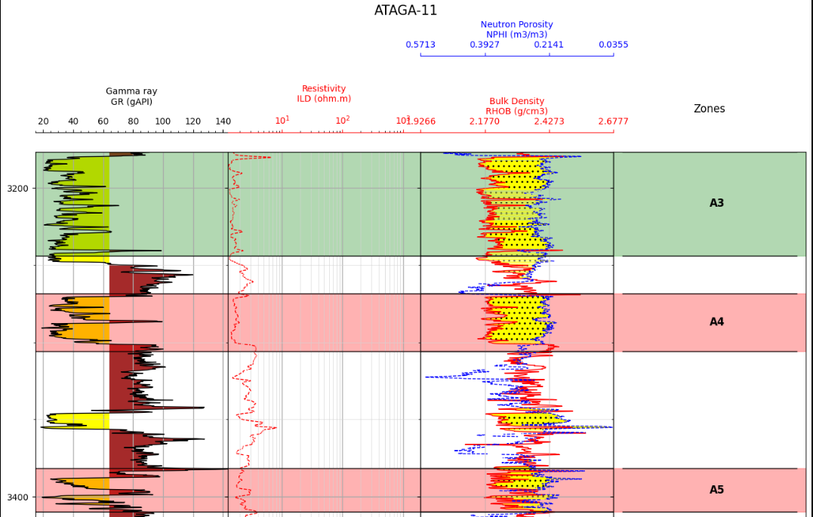
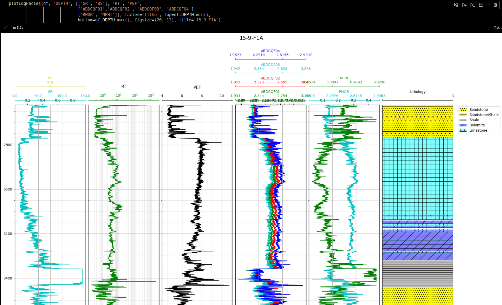
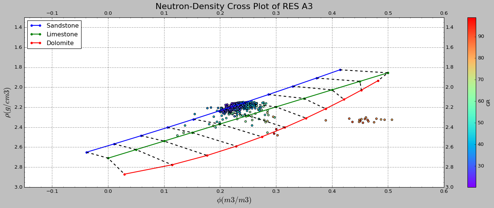
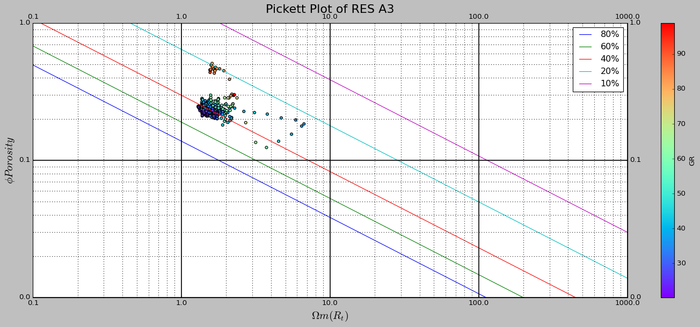

# Petrolib tutorials

[`Petrolib`](https://github.com/joshua-atolagbe/petrolib) is a python package designed to help users perform petrophysical analysis by estimating petrophysical parameters such as:

* Volume of Shale using various methods like Clavier, Stieber and Larionov methods
* Porosity - Effective and Total porosities using the density and Wyllie's sonic methods.
* Water Saturation - using both archie and simmandoux methods
* Permeability

In addition to estimating these parameters, log plots are automatically displayed for proper interpretation. Also a pay summary result/dataframe is produced to help quantify the over-all quality of the reservoirs. Cutoff such as the porosity, shale volume and water saturation are applied to flag pay regions. The pay summary include:

* net, gross and not net thicknesses
* % net-to-gross
* average volume of shale
* average porosity
* bulk volume of water
* water saturation.

# Pay summary report

# Zone plots

# Lithofacies plot  

# Cross plot

# Picket plot

